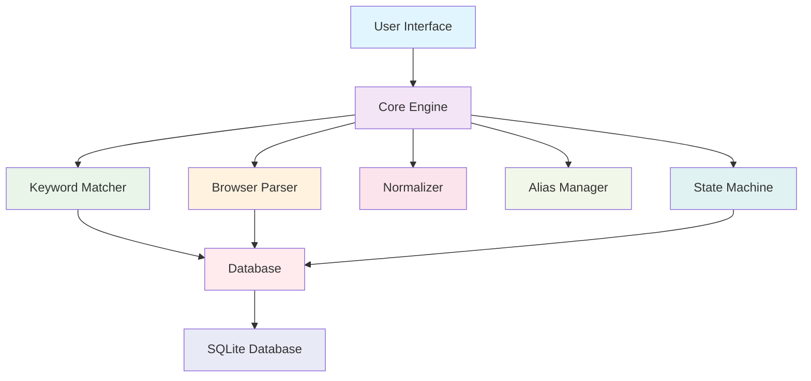
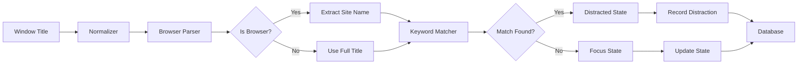
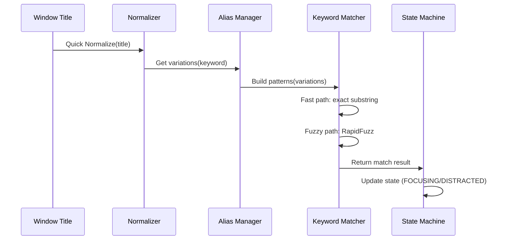

# System Architecture - Focus Garden

## Overview

Focus Garden is a productivity application that tracks user focus sessions and distractors in real-time using advanced fuzzy matching and browser parsing techniques. The system uses modular architecture with each component under 200 lines of code for maintainability.

## Core Architecture



## Component Architecture

### 1. Core Modules (Under 200 lines each)

#### **Keyword Matcher (`core/matcher.py`)**
- **Purpose**: Fuzzy matching using RapidFuzz library
- **Technology**: RapidFuzz with 85% threshold
- **Key Features**:
  - Exact substring matching (fast path)
  - Fuzzy matching for partial matches
  - Integrates with alias expansion
  - Performance optimized for real-time use

#### **Text Normalizer (`core/normalizer.py`)**
- **Purpose**: Text normalization for Vietnamese/English support
- **Technology**: Unicode NFC normalization, regex filtering
- **Key Features**:
  - Unicode NFC canonical composition
  - Vietnamese diacritic preservation
  - Special character removal
  - Fast normalization for performance path

#### **Alias Manager (`core/alias-manager.py`)**
- **Purpose**: Application name alias expansion
- **Technology**: Dictionary-based lookup
- **Key Features**:
  - Built-in alias dictionary for common apps
  - Case-insensitive matching
  - Reverse alias lookup
  - Vietnamese/English app support

#### **Browser Parser (`core/browser-parser.py`)**
- **Purpose**: Smart browser title parsing
- **Technology**: Regular expressions pattern matching
- **Key Features**:
  - Extracts site names from browser titles
  - Handles grouped tabs ("Facebook and 3 other tabs")
  - Multi-browser support (Chrome, Firefox, Edge, etc.)
  - Browser keyword detection

#### **State Machine (`core/tracker.py`)**
- **Purpose**: Focus state management
- **Technology**: Finite state machine pattern
- **Key Features**:
  - FOCUSING <-> DISTRACTED transitions
  - 10-second buffer for state changes
  - 1-second polling interval
  - State recording with timestamps

### 2. Database Layer

#### **Database Models (`database/models.py`)**
- SQLite-based storage
- Tables: sessions, distractions, app_usage
- Automatic schema migrations

#### **Database Configuration (`database/db_config.py`)**
- Connection pooling
- Session management
- Error handling

### 3. User Interface Layer

#### **Main Components (`ui/`)**
- **MainWindow**: Main application window
- **CreateSessionWidget**: Session creation interface
- **HistoryWidget**: Session history display
- **SummaryDialog**: Session statistics
- **TreeWidget**: Hierarchical data display

## Data Flow Architecture



## Fuzzy Matching Pipeline



## Performance Architecture

### Performance Optimizations

1. **Fast Path First**: Exact substring matching before fuzzy matching
2. **Quick Normalize**: Fast normalization for performance-critical path
3. **Pattern Pre-building**: Patterns cached at initialization
4. **State Caching**: Previous state used for optimization
5. **Modular Design**: Each component optimized independently

### Performance Targets

- **Matching Speed**: <1ms per title in fast path
- **File Size**: <200 lines per module
- **Memory Usage**: Minimal memory footprint
- **CPU Usage**: Low CPU usage for continuous monitoring

## Browser Support Architecture

### Supported Browsers
- Google Chrome
- Mozilla Firefox
- Microsoft Edge
- Opera
- Brave
- Vivaldi

### Browser Title Parsing Patterns
```python
# Standard format: "Site - Browser"
"GitHub - Google Chrome" -> ("GitHub", True)

# Standard format: "Site | Browser"
"Stack Overflow | Mozilla Firefox" -> ("Stack Overflow", True)

# Grouped tabs: "Site and N other tabs"
"Facebook and 3 other tabs" -> (None, True)

# Browser keywords
"Google Chrome Settings" -> ("Google Chrome Settings", True)
```

## Vietnamese Language Support

### Normalization Pipeline
1. **Unicode NFC**: Normalize character composition
2. **Lowercase**: Case normalization
3. **Diacritic Preservation**: Maintain Vietnamese characters (à, ế, ồ, etc.)
4. **Special Character Removal**: Remove unwanted symbols
5. **Whitespace Normalization**: Collapse multiple spaces

### Supported Characters
```python
# Vietnamese diacritic ranges
Vietnamese_Ranges = [
    (0x1EA0, 0x1EF9),  # Vietnamese extended
    (0x00C0, 0x017F),  # Latin extended
]
```

## Error Handling Architecture

### Graceful Degradation
- Fuzzy matching fallback to exact matching
- Empty input handling
- Partial pattern matching
- Performance throttling on errors

### Error Recovery
- Automatic pattern rebuilding
- Database connection retry
- UI state preservation
- Application stability maintenance

## Integration Architecture

### Module Dependencies
```
KeywordMatcher -> Normalizer, AliasManager
BrowserParser -> Normalizer
StateMachine -> Database
All UI -> Core Engine
```

### Data Persistence
- SQLite for local storage
- Automatic schema updates
- Session history tracking
- Statistical aggregation

## Testing Architecture

### Comprehensive Test Suite
- **Unit Tests**: Individual component testing
- **Integration Tests**: Module interaction testing
- **Performance Tests**: Speed and memory validation
- **Edge Case Tests**: Error condition handling

### Test Coverage
- 100% of core modules tested
- Performance benchmarks enforced
- Vietnamese character support verified
- Browser parsing accuracy validated

## Future Architecture Extensions

### Planned Enhancements
1. **Cloud Sync**: Remote database integration
2. **Machine Learning**: Improved fuzzy matching algorithms
3. **Cross-Platform**: Windows/Linux/macOS support
4. **Mobile Integration**: Mobile app synchronization
5. **Analytics Engine**: Advanced productivity insights

### Scalability Considerations
- Modular design allows easy feature addition
- Component isolation prevents cascading failures
- Performance targets ensure scalability
- Database schema supports future features

---

*Last Updated: April 15, 2026*
*Version: 2.0.0*
*Status: Core architecture complete with fuzzy matching and browser parsing*